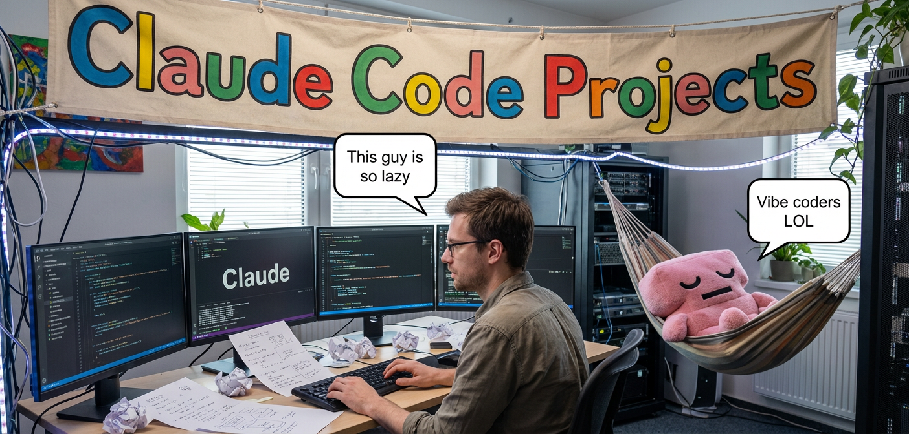
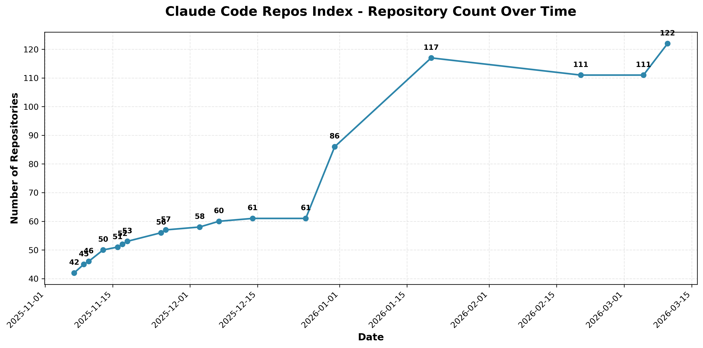

# Claude Code Projects Index

A curated collection of Claude Code projects, agent workspace blueprints, and related resources — organized by use case. Most patterns here adapt to other agentic AI CLIs and frameworks.

**[Browse online](https://claude.danielrosehill.com)** · **[Plugins Marketplace](https://github.com/danielrosehill/Claude-Code-Plugins)** · **[Documentation portal](https://docs.bydanielrosehill.com)** · **[Agent Workspace Model](https://github.com/danielrosehill/Claude-Agent-Workspace-Model)** · **[What are Claude Spaces?](./claude-spaces.md)**

> 🧩 **My Claude Code Plugins Marketplace** — [danielrosehill/Claude-Code-Plugins](https://github.com/danielrosehill/Claude-Code-Plugins) — centralized marketplace bundling the plugins referenced throughout this index (including the [New-Repo-From-Template plugin](#templates--scaffolds) for scaffolding workspaces).

---

## Contents

**Workspaces by Domain**
- [Systems Administration](#systems-administration)
- [Productivity & Planning](#productivity--planning) · [Legal](#legal) · [Health & Wellbeing](#health--wellbeing) · [Communications & Writing](#communications--writing) · [Financial Planning](#financial-planning) · [Career](#career) · [Business](#business) · [Privacy & Anonymity](#privacy--anonymity) · [Technology & Hardware](#technology--hardware) · [Marketing](#marketing)
- [Research](#research)
- [Argument and Perspective Exploration](#argument-and-perspective-exploration)

**Configuration & Tooling**
- [Context and Personalization](#context-and-personalization)
- [Multi-Agent Tooling](#multi-agent-tooling)
- [MCP (Model Context Protocol)](#mcp-model-context-protocol)

**Extensions & Scaffolds**
- [Plugins](#plugins)
- [Templates / Scaffolds](#templates--scaffolds) — *recommended way to spin up a new workspace*
- [Slash Commands](#slash-commands)

**Other**
- [Miscellaneous](#miscellaneous)

---

## About This Index

I've been using Claude Code daily for about six months — for development, but also audio editing, legal research, SEO analysis, health documentation, systems administration, and a long tail of non-code use cases. This index is the result: a collection of **agent workspaces** (repositories structured as self-contained environments for a specific activity) alongside supporting tooling — plugins, context files, MCP servers, and slash commands.

If there's a common thread, it's treating Claude Code less as a coding assistant and more as a general-purpose agent workspace that happens to run in a terminal.

| Type | What it is | Badge |
|------|------------|-------|
| **Agent Workspace** | Pre-configured repo using Claude as a conversational UI for a domain-specific workflow |  |
| **Template** | Forkable starting point you can customize |  |
| **Non-Code** | Applications beyond software development |  |

<strong>More context: the Agent Workspace Model, growth chart, praise</strong>

#### The Agent Workspace Model

All workspaces in this index follow the pattern defined in the **[Claude Agent Workspace Model](https://github.com/danielrosehill/Claude-Agent-Workspace-Model)** repository. The core idea: a Git repository isn't just for code — it can serve as a complete, self-contained workspace for *any* activity. Each workspace uses a defined folder structure, a `CLAUDE.md` for agent instructions, slash commands, MCP configurations, and subagent definitions to create a purpose-built environment.

This pattern has been applied to everything from sysadmin and remote server management to legal research, health documentation, and financial planning — domains that have nothing to do with software development.

**Want to follow this approach?** Point Claude Code at the [model repository](https://github.com/danielrosehill/Claude-Agent-Workspace-Model) to give it context on the pattern, then ask it to scaffold a new workspace for your use case. Or — simpler — use the [New-Repo-From-Template plugin](#templates--scaffolds), which packages the curated templates into a one-command scaffold.

#### Repository Growth

#### Praise

> *"This is either the work of a prolific genius, or a very clever bot (or both), although it hardly matters because the quality is so good - an index of 75+ Claude Code repositories published by the author... CMS, system design, deep research, IoT, agentic workflows, server management, personal health... If you spot the lie, let me know, otherwise please check these out."*
>
> — [awesome-claude-code](https://github.com/wong2/awesome-claude-code)

For the record: I'm a real human ([danielrosehill.com](https://danielrosehill.com)). The repos and workspaces in this index are generated with Claude Code but human-designed and refined.

#### Additional reading

- 📝 **[Notes on Templates & Workspaces](./notes.md)**
- 📖 **[What are Agent Workspaces?](./claude-spaces.md)**

---

# Systems Administration

Projects involving using Claude for local or remote systems administration as distinct from development-related projects.

> **See also:** The **[Claude Code Sysadmin Workspaces Index](https://github.com/danielrosehill/Claude-Code-Sysadmin-Workspaces-Index)** is a dedicated sub-index for all sysadmin workspace templates.

### Bash Alias Manager Claude

Workspace for managing bash aliases with YADM synchronization support.

---

### Claude Bug Catcher

Hotkey-triggered utility that launches Claude Code with relevant logs for real-time Linux debugging.

---

### Claude Code Bash Aliases

Collection of bash aliases for common Claude Code operations on Linux.

---

### Claude Code LAN Manager
  

Workspace for centralized management of multiple LAN-connected machines through Claude Code.

#### Claude LAN Manager GUI

GUI application for managing local network devices through isolated, device-specific agent workspaces.

---

### Claude Conda Manager
 

Workspace for managing Conda environments on Ubuntu workstations with AMD ROCm hardware.

---

### Claude Rescue

Concept for deploying Claude Code into recovery shell environments for AI-assisted system repair.

---

### Claude Server Manager Template
  

Server administration template with 38 slash commands and 10 agents optimized for Docker deployments.

---

### Claude System Recovery Mode

Custom GRUB boot entry integrating Claude CLI into Linux system recovery workflows.

---

## Linux - KDE Plasma

Projects specifically targeting KDE Plasma desktop integration and Linux desktop workflows with Claude Code.

### Claude Dolphin & Konsole Actions

KDE Dolphin right-click context menu actions (service menus) for launching Claude Code in various Konsole window layouts, including single terminal, split panes, and multi-instance grids.

---

### Claude Bug Catcher

Hotkey-triggered utility that launches Claude Code with relevant logs for real-time Linux debugging.

---

### Claude System Recovery Mode

Custom GRUB boot entry integrating Claude CLI into Linux system recovery workflows.

---

## Android

### Claude MVT Workspace
  

Workspace orchestrating Mobile Verification Toolkit (MVT) spyware scans on Android devices via ADB, detecting indicators of compromise from targeted malware like Pegasus.

---

# Productivity & Planning

Workspaces for decision-making, personal planning, file management, and general-purpose productivity workflows.

> **See also:** The **[Claude Code Workspace Templates Index](https://github.com/danielrosehill/Claude-Code-Workspace-Templates-Index)** is a dedicated sub-index for all domain-specific workspace templates (budgeting, health, research, writing, etc.).

### Claude Personal Development Workspace
  

Workspace for tracking habits, skill acquisition, and self-improvement goals with AI coaching.

---

# Legal

Workspaces and templates for legal research, case management, and evidence handling workflows.

### ProofMode Unpacker
  

Utility for managing ProofMode evidence bundles with automated cloud backup and chain of custody preservation.

---

# Health & Wellbeing

Workspaces and templates for health documentation, medical visit management, therapy tracking, and health-related research.

### Claude Health Helper
   

Workspace for organizing personal health documentation, visit preparation, and medical report summaries.

---

# Communications & Writing

Workspaces and templates for content creation, blog management, writing workflows, and communications strategy.

### Claude Code Writing Squad
 

Multi-agent writing system that refines text through specialized editing agents.

---

### Claude Website Update Sender

Automated workflow for sending polished update emails about website changes via Resend MCP.

---

### Declaude
 

Personalized text rewriting rules that consolidate into a slash command for refining AI-generated documentation.

---

# Financial Planning

Workspaces and templates for budgeting, purchasing decisions, and personal finance management.

# Career

Workspaces and templates for job searching, career planning, and professional development.

### Claude Career Planning Template
  

Continuous professional development workspace tracking career goals, skills gap analysis, CPD log, courses, certifications, conferences, and quarterly learning plans — produces CV/LinkedIn-ready career narratives.

---

# Business

Workspaces and templates for business planning, idea evaluation, and organizational continuity.

### Claude Business Continuity Planner
  

Workspace for developing ISO 22301-aligned business continuity programs with slash commands.

---

# Privacy & Anonymity

Workspaces and templates for document redaction, identity protection, and PII obfuscation.

# Technology & Hardware

Workspaces for hardware planning, PC builds, and technology procurement.

### Claude Ivory PC Builder
 

AI-powered PC component spec generator with real-time pricing from an Israeli retailer, historical price tracking, and compatibility verification.

---

# Marketing

Workspaces for SEO, web analytics, PR monitoring, and media tracking.

### Claude Media Monitor
   

Workspace for systematic news collection and organization with metadata and schema validation.

---

### Claude News Fetcher - Media Monitoring System
   

Full-featured media monitoring workspace with structured data capture and batch processing.

---

# Research

Projects using Claude and agentic systems for deep research, report generation, and information synthesis.

**[See full list in the dedicated research page →](./research.md)** (2 entries)

---

# Argument and Perspective Exploration

Projects using AI for synthesized debate to explore various perspectives, including policy modeling and analysis.

### Claude Change My View
   

Workspace for challenging personal beliefs through AI-generated counterarguments and rebuttals.

---

# Context and Personalization

Projects exploring using Claude and related tooling for personalized user engagement, including through RAG, interviewing methods, and context injection.

### Batch ClaudeMD Repo Creator

Automation workspace for batch-adding CLAUDE.md files across multiple GitHub repositories.

---

### Claude Code Context Toolkit
  

Bridges human-friendly CONTEXT.md files with AI-optimized CLAUDE.md briefings via slash commands.

---

### Claude Code Repo Managers ClaudeMD
 

Pre-configured CLAUDE.md templates for managing different repository types.

---

### Claude Model Identifier
 

Prompt template for verifying the correct Claude model variant at conversation start.

---

### CONTEXT.md
 

Workflow methodology for separating human-authored context from structured AI agent briefings.

---

### Linux Desktop ClaudeMD Seeder
 

Automatically generates contextual CLAUDE.md files across a Linux desktop filesystem.

---

### Private And Public Claude MD

Tools for managing public and private CLAUDE.md files with security-focused git configuration.

---

### The User Voice Types
  

CLAUDE.md snippets and slash commands telling Claude to silently infer around transcription errors from voice typing and stray keystrokes from one-handed or distracted typing.

---

# Multi-Agent Tooling

Components and tooling for multi-agent development and orchestration frameworks.

## Multi-Agent Systems

### Agent Junction
 

MCP server enabling encrypted peer-to-peer communication between Claude Code instances on localhost or LAN.

---

### Claude Agent Picker Pattern
 

Framework for assembling context-optimized multi-agent crews with minimal overlap.

---

### Claude Agent Workspace Generator
 

Launchpad for creating standardized workspace templates conforming to the Agent Workspace Model v1.1 spec, with slash commands to generate, validate, and publish new workspaces.

---

### Claude Task Manager
 

Sequential task queuing system addressing context window exhaustion in agentic coding tools.

---

## Agent Libraries & Collections

### Claude Development Agents
 

Curated toolkit of 74+ Claude Code configurations for development workflows and multi-agent coordination.

---

### Claude Sub-Agent Network
 

Collection of system prompts and configurations for development, operational, and creative tasks.

---

### Cool Claude Code Stuff

Curated collection of Claude Code projects and resources organized by category.

---

## Workspace Setup & Management

### Claude Workspace Setup Helper
 

Interactive tool for discovering, selecting, and cloning Claude Workspace templates.

---

## Documentation & Notes

### Claude Code Linux Notes

Personal documentation of workflows and tips for using Claude Code on Ubuntu with KDE Plasma.

---

# MCP

Projects related to Claude and MCP tooling and setup.

### Claude Code MCP Command Generator

Generator for creating MCP server configuration commands for Claude Code.

---

### How-To-MCP

Guide for instructing AI agents on how to provision and manage MCP server connections according to user-specific preferences, with a tiered decision matrix.

---

### Claude Code MCP List

Curated index of MCP servers organized into 14+ categories for extending Claude Code.

---

### MCPM Claude Code Docs

Documentation for integrating Claude Code with MCPM external MCP server manager.

---

### Smithery Claude Code MCP Jumpstarter

Curated collection of 35+ MCP servers with interactive installer across 15+ categories.

---

<!-- GENERATED FROM data/marketplace.json — do not edit by hand. Run scripts/sync_marketplace.py or npm run build. -->

# Plugins

All plugins registered in the [danielrosehill marketplace](https://github.com/danielrosehill/Claude-Code-Plugins). Install any of these with `/plugin install <name>@danielrosehill`.

## Systems Administration

**[See full list in the dedicated plugins page →](./plugins.md)** (52 entries)

---

# Templates / Scaffolds

**Recommended entry point for spinning up a new workspace.** The workspace scaffolds that were previously listed individually in this index are still published as standalone template repositories on GitHub, but the recommended way to use them is through the **New-Repo-From-Template plugin**, which packages the curated catalogue into a one-command scaffold for Claude Code. The plugin is periodically updated as new templates are added, so it stays in sync with the standalone repos without duplicating their listings here.

### New Repo From Template Plugin
 

Claude Code plugin that scaffolds new workspaces from a catalogue of 80+ template repositories spanning development, research, legal, finance, infrastructure, planning, writing, personal, knowledge, and simulation workflows. Each template is also available as a standalone GitHub repo for direct forking — the plugin simply provides a faster, unified way to instantiate them locally. See the plugin's [templates manifest](https://github.com/danielrosehill/New-Repo-From-Template-Plugin/blob/master/templates/manifest.json) for the full list.

---

# Slash Commands

Individual slash commands, sometimes integrated into other plugins or sometimes just for use at the user level.

> **See also:** The **[Claude Slash Commands](https://github.com/danielrosehill/Claude-Slash-Commands)** repo serves as both a 350+ command library and the dedicated index for all slash command repos.

### AI-Human Attribution Adder
 

Adds AI/human attribution sections to README files for transparent tool usage documentation.

---

### Claude App Optimiser
  

Slash command deploying a sub-agent for codebase optimization and dead code removal.

---

### Claude Calls The Shots
 

Flips Claude Code into autonomous, action-first mode — ships a per-session `/calls-the-shots` slash command plus an optional always-on snippet injected into `~/.claude/CLAUDE.md`.

---

### Claude Code Linux Desktop Slash Commands
 

System administration slash commands for Linux desktop environments.

---

### Claude Document This
 

Methods and slash commands for documenting system changes made by Claude Code.

---

### Claude File Organiser Super Slash
 

Slash command that transforms disorganized filesystems into well-structured directories.

---

### Claude MD Chunk
 

Slash command that condenses bloated CLAUDE.md files to essentials and organizes supplementary context into a structured `agent-context/` folder.

---

### Claude Slash Commands
 

General-purpose slash command library for various Claude Code workflows.

---

### No Wheel Inventions
  

Slash commands encouraging use of existing libraries instead of building custom solutions.

---

# Miscellaneous

Other projects including meta-resources, feedback, and utilities that span multiple categories.

**[See full list in the dedicated misc page →](./misc.md)** (19 entries)

---
